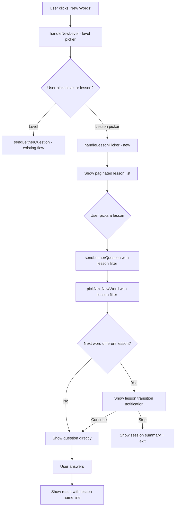

# Design Document: Lesson-Aware Leitner

## Overview

This feature adds lesson-awareness to the Leitner vocabulary learning system. It introduces four capabilities:

1. **Lesson transition notification** — When learning new words, detect if the next word belongs to a different lesson and prompt the user to continue or stop.
2. **Lesson name in answer feedback** — Display the lesson name of the word in the response message after answering a question.
3. **Lesson name normalization (trim)** — Normalize lesson names by trimming whitespace for comparison and display without modifying DB values.
4. **Lesson picker** — Allow users to pick a specific lesson when starting new word learning, with paginated lesson list.

No database schema changes are required since `lesson_name` already exists in the `words` table. All changes are application-level in the handler (`src/bot/handlers/leitner.ts`), DB query layer (`src/db/leitner.ts`), and constants (`src/config/constants.ts`).

## Architecture

The feature integrates into the existing Leitner callback-based flow. The architecture follows the existing pattern: handler → DB queries → Telegram API.



### Key Design Decisions

1. **Lesson tracking via mode suffix** — The "lesson" mode is encoded as `newL:{offset}` in the mode parameter. The offset is the index of the lesson in the sorted lesson list, keeping callback data compact.

2. **Lesson transition detection** — After a user answers a question in new-word mode, before fetching the next question we peek at the next word's lesson. If it differs from the current word's lesson, we show the transition notification instead of the next question.

3. **Trim normalization at application level** — All lesson name comparisons and displays use `trimLessonName()` helper. DB values remain untouched.

4. **Callback data budget** — Telegram limits callback data to 64 bytes. We use numeric offsets for lesson selection (`llp:{page}:{offset}`) and short prefixes for new callback types.

## Components and Interfaces

### New Constants (`src/config/constants.ts`)

```typescript
// New callback prefixes
CB_PREFIX.LEITNER_LESSON_PICK = "llp";     // lesson picker page/select
CB_PREFIX.LEITNER_LESSON_CONT = "llc";     // lesson transition continue
CB_PREFIX.LEITNER_LESSON_STOP = "lls";     // lesson transition stop

// Pagination
LESSON_PICKER_PAGE_SIZE = 20;
```

### New/Modified DB Functions (`src/db/leitner.ts`)

```typescript
/** Get distinct lessons with unlearned word counts for a user, ordered by min order_index. */
export async function getUnlearnedLessons(
  env: Env, 
  userId: number, 
  level?: number
): Promise<{ lesson_name: string | null; word_count: number; min_order: number }[]>

/** Count new words filtered by lesson (trimmed comparison). */
export async function countNewWordsByLesson(
  env: Env, 
  userId: number, 
  lessonName: string | null
): Promise<number>

/** Pick next new word filtered by lesson. */
export async function pickNextNewWordByLesson(
  env: Env, 
  userId: number, 
  lessonName: string | null
): Promise<DbWord | null>

/** Peek at the next new word without consuming it (for transition detection). */
export async function peekNextNewWord(
  env: Env, 
  userId: number, 
  level?: number, 
  lessonName?: string | null
): Promise<DbWord | null>
```

### New Utility Function (`src/utils/lesson.ts`)

```typescript
/** Trim whitespace from lesson name. Returns null if input is null or empty after trim. */
export function trimLessonName(name: string | null | undefined): string | null

/** Compare two lesson names after trimming (case-sensitive). Both null = equal. */
export function lessonNamesEqual(a: string | null | undefined, b: string | null | undefined): boolean
```

### Modified Handler Functions (`src/bot/handlers/leitner.ts`)

- `handleNewLevel` — Add "انتخاب بر اساس درس" button to level picker.
- `handleLessonPicker` (new) — Show paginated lesson list, handle page navigation and lesson selection.
- `sendLeitnerQuestion` — After answering in new-word mode, detect lesson transitions.
- `handleAnswer` — Add lesson name line to result message.
- `handleDunno` — Add lesson name line to result message.
- `handleLessonTransition` (new) — Handle continue/stop buttons on transition notification.

### New Mode: Lesson-filtered Learning

A new `ReviewMode` variant is needed. Rather than adding many modes, we use a session-state approach:

- When a user selects a lesson from the picker, we store the chosen lesson's raw name in a lightweight session concept (encoded in callback data as offset index).
- The mode `newL` indicates lesson-filtered new-word learning.
- The offset is carried through callbacks: `lnx:newL:{offset}` for "next question".

Since callback data is limited to 64 bytes and the mode is embedded in answer/next/exit callbacks, we keep the offset as a small integer (max 3 digits) which fits comfortably.

## Data Models

### Lesson List Item (Runtime)

```typescript
interface LessonListItem {
  lessonName: string | null;  // raw DB value
  displayName: string;        // trimmed, or "بدون درس" for null
  wordCount: number;          // unlearned words in this lesson for user
  minOrder: number;           // min order_index (for sorting)
}
```

### Lesson Transition State (Implicit via Callback Data)

No persistent state is needed. The current word's lesson is known from the question just answered. The next word's lesson is peeked from DB. The lesson-filtered mode carries the lesson offset in callback data.

### Callback Data Formats

| Action | Format | Example | Bytes |
|--------|--------|---------|-------|
| Lesson picker page | `llp:{page}` | `llp:2` | 5 |
| Select lesson | `llp:s:{offset}` | `llp:s:5` | 7 |
| Continue after transition | `llc:{mode}` | `llc:newL:5` | 10 |
| Stop after transition | `lls:{mode}` | `lls:newL:5` | 10 |
| Next in lesson mode | `lnx:newL:{offset}` | `lnx:newL:12` | 11 |
| Exit in lesson mode | `lex:newL:{offset}` | `lex:newL:12` | 11 |
| Answer in lesson mode | `l:{qid}:{opt}:newL:{offset}` | `l:1234:A:newL:5` | 15 |

All well within 64-byte limit.

## Correctness Properties

*A property is a characteristic or behavior that should hold true across all valid executions of a system—essentially, a formal statement about what the system should do. Properties serve as the bridge between human-readable specifications and machine-verifiable correctness guarantees.*

### Property 1: Trim normalization is idempotent and only removes edge whitespace

*For any* string value (including null), applying `trimLessonName` twice produces the same result as applying it once, the output has no leading or trailing whitespace, and all internal whitespace (between non-whitespace characters) is preserved unchanged.

**Validates: Requirements 3.1, 3.2, 3.4**

### Property 2: Lesson name equality is symmetric and consistent with trim

*For any* two lesson name values `a` and `b`, `lessonNamesEqual(a, b) === lessonNamesEqual(b, a)`, and `lessonNamesEqual(a, b)` is true if and only if `trimLessonName(a) === trimLessonName(b)` (where both null is considered equal).

**Validates: Requirements 3.1, 1.6**

### Property 3: Lesson transition detection correctness

*For any* two consecutive words in a new-word session where neither is the first word of the session, a lesson transition notification is shown if and only if `lessonNamesEqual(currentWord.lesson_name, nextWord.lesson_name)` is false.

**Validates: Requirements 1.1, 1.4, 1.5, 1.6**

### Property 4: Lesson picker shows exactly the lessons with unlearned words (no more, no less)

*For any* user and word set, the lesson picker list contains an entry for a lesson if and only if there exists at least one active word with that trimmed lesson name that is not in `user_words_sm2` for that user. The word count shown for each lesson equals the actual number of such unlearned words.

**Validates: Requirements 4.3, 4.4**

### Property 5: Lesson picker deduplicates trimmed lesson names

*For any* lesson list generated for the picker, no two entries have the same trimmed lesson name. Words with lesson names that differ only by leading/trailing whitespace are grouped into a single entry with combined count.

**Validates: Requirements 3.3**

### Property 6: Lesson-filtered learning only produces words from the selected lesson

*For any* word returned by the lesson-filtered word picker, the trimmed lesson name of that word equals the trimmed lesson name of the selected lesson (including null matching null).

**Validates: Requirements 4.8**

### Property 7: Pagination invariants

*For any* lesson list with `n` total lessons and page size 20: page 1 shows items 1–min(20, n); the last page number is `ceil(n/20)`; page 1 has no "previous" button; the last page has no "next" button; middle pages have both buttons.

**Validates: Requirements 4.5, 4.6, 4.7**

### Property 8: Lesson name display in feedback is shown IFF trimmed name is non-null

*For any* word with a lesson_name value, the answer feedback message includes the "📖 درس: [name]" line if and only if `trimLessonName(lesson_name)` is non-null (i.e., the original value is neither null nor whitespace-only).

**Validates: Requirements 2.1, 2.2**

## Error Handling

| Scenario | Handling |
|----------|----------|
| Lesson has no unlearned words at start time | Show "واژه‌ای برای یادگیری در این درس باقی نمانده" and return to lesson list (Req 4.11) |
| All words exhausted during lesson learning | Show completion message with session stats |
| Invalid page number in callback | Default to page 1 |
| Invalid lesson offset in callback | Show error and return to lesson picker |
| Race condition: word learned between peek and display | Gracefully skip to next word (existing retry loop handles this) |
| Callback data corruption | Answer callback with error toast, show home button |

## Testing Strategy

### Unit Tests (Example-Based)

- Lesson transition notification message formatting (correct text for null/non-null lessons)
- Lesson name display line formatting in answer feedback
- "بدون درس" label for null lesson names
- Callback data parsing for new prefixes (`llp`, `llc`, `lls`)
- First word in session never triggers transition notification (Req 1.7)
- "Don't know" handler includes lesson name line (Req 2.3)
- Lesson display is consistent across modes (Req 2.4)
- Lesson picker button appears in level selection menu (Req 4.1)
- Null lesson group shown as "بدون درس" at end of list (Req 4.10)
- Empty lesson selection shows error and returns to list (Req 4.11)

### Property-Based Tests

This feature has clear pure-function logic suitable for property-based testing:

- **Property 1**: `trimLessonName` idempotence + edge-only removal + internal whitespace preservation
- **Property 2**: `lessonNamesEqual` symmetry and consistency with trim
- **Property 3**: Lesson transition detection (notification IFF lessons differ)
- **Property 4**: Lesson picker list completeness and count accuracy
- **Property 5**: Lesson picker deduplication of trimmed names
- **Property 6**: Lesson-filtered word picker only returns words from selected lesson
- **Property 7**: Pagination button visibility rules
- **Property 8**: Lesson name display line presence IFF non-null trimmed name

**Library**: `fast-check` (TypeScript property-based testing library)
**Configuration**: Minimum 100 iterations per property test.

Each property test is tagged with:
```typescript
// Feature: lesson-aware-leitner, Property {N}: {property_text}
```

### Integration Tests

- Full lesson picker flow: select lesson → get questions from that lesson only
- Lesson transition: answer word from lesson A → next word from lesson B → notification shown
- Session stop from transition notification → stats displayed correctly
- Lesson picker pagination navigation (next/prev pages)
- DB values remain unchanged (no writes to `lesson_name` column)

### What Is NOT Property-Tested

- Telegram API interactions (mocked in integration tests)
- D1 query correctness (tested via integration with miniflare/D1 mock)
- UI text formatting specifics (example-based tests)
- DB value immutability (integration test with query assertions)
