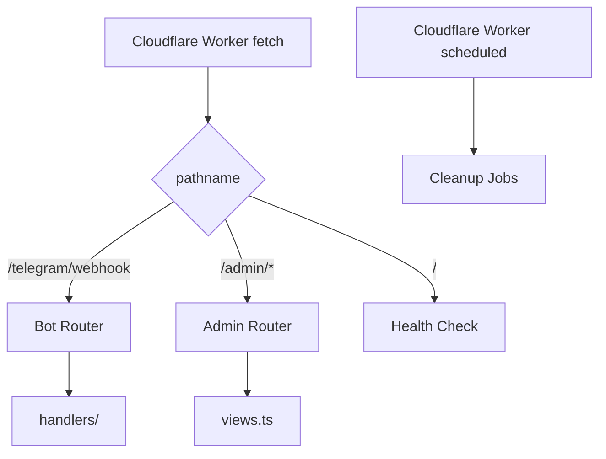
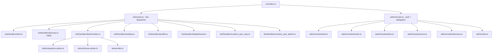

# Design Document: Zero-Risk Refactor

## Overview

This design describes the structural refactoring of the Ravan English Bot codebase to improve readability, modularity, and maintainability — without any changes to user-visible behavior, database schema, or external API contracts.

The refactoring targets six key areas:
1. Dead code removal
2. Type extraction and consolidation
3. Bot router decomposition
4. Admin panel decomposition into domain modules
5. Leitner handler decomposition
6. Type safety improvements and code readability

**Guiding principle**: Every change is a mechanical move-or-extract operation. No string literals, SQL queries, keyboard layouts, or response structures change. The existing test suite and `tsc --noEmit` serve as the safety net.

## Architecture

The current architecture is a Cloudflare Worker with two entry paths:



**After refactoring**, the architecture remains identical at the system level. Changes are internal to module boundaries:



## Components and Interfaces

### 1. Telegram Types Module (`src/bot/types.ts`) — NEW

Consolidates all Telegram-specific interfaces currently inlined in `src/bot/router.ts`.

```typescript
// src/bot/types.ts
export interface TelegramUser { ... }
export interface TelegramChat { ... }
export interface TelegramMessage { ... }
export interface TelegramCallbackQuery { ... }
export interface TelegramUpdate { ... }
```

All files importing these types from `../bot/router` will be updated to import from `../bot/types`.

### 2. Bot Router (`src/bot/router.ts`) — SLIMMED

After extraction, the bot router becomes a pure dispatcher with no direct DB calls:

```typescript
// src/bot/router.ts
import { TelegramUpdate, TelegramCallbackQuery } from "./types";
import { handleLicenseFlow } from "./handlers/license";
import { checkAndCancelStaleSession } from "./handlers/reading";
// ... other handler imports

export async function handleTelegramUpdate(env: Env, update: TelegramUpdate): Promise<void> { ... }
async function handleCallback(env: Env, cb: TelegramCallbackQuery): Promise<void> { ... }
async function handleMessage(env: Env, update: TelegramUpdate): Promise<void> { ... }
```

The router will:
- Import `handleLicenseFlow` from `./handlers/license` (covers `extractLicenseCode`, `applyLicenseCode`, new-user and unapproved-user flows)
- Import `checkAndCancelStaleSession` from `./handlers/reading` (covers the stale session query + 2-hour age check)
- Contain NO imports from `src/db/client` — all DB access happens inside handlers

### 3. License Handler (`src/bot/handlers/license.ts`) — NEW

Extracted from the bot router. Contains:

```typescript
// src/bot/handlers/license.ts
export function extractLicenseCode(text: string): string { ... }
export async function applyLicenseCode(env: Env, user: DbUser, code: string): Promise<{ ok: boolean; expireMessage: string }> { ... }
export async function handleNewUserLicenseFlow(env: Env, chatId: number, tgUser: TelegramUser, text: string): Promise<boolean> { ... }
export async function handleUnapprovedUserLicenseFlow(env: Env, chatId: number, user: DbUser, text: string): Promise<boolean> { ... }
```

### 4. Reading Handler Extension (`src/bot/handlers/reading.ts`) — MODIFIED

Gains a new exported function:

```typescript
// Added to src/bot/handlers/reading.ts
export async function checkAndCancelStaleSession(env: Env, user: DbUser, chatId: number): Promise<boolean> { ... }
```

This function encapsulates:
- The `activeReadingSession` query
- The 2-hour staleness comparison
- Auto-cancel logic
- The "you have an active session" message

Returns `true` if a message was sent (caller should return early), `false` otherwise.

### 5. Admin Router (`src/admin/router.ts`) — SLIMMED

Becomes a thin orchestrator:

```typescript
// src/admin/router.ts
import { handleAuthRoutes } from "./routes/auth";
import { handleWordRoutes } from "./routes/words";
import { handleTextRoutes } from "./routes/texts";
import { handleUserRoutes } from "./routes/users";
import { handleLicenseRoutes } from "./routes/licenses";
import { isAdminAuthed, checkCsrf } from "./utils";

export async function handleAdminRequest(request: Request, env: Env): Promise<Response> {
  // 1. CSRF check (POST)
  // 2. Login page / login POST / logout (delegate to auth)
  // 3. Auth guard
  // 4. Delegate to domain module based on pathname prefix
}
```

### 6. Admin Route Modules (`src/admin/routes/`)

| File | Routes Handled |
|------|---------------|
| `auth.ts` | `/admin` (login page), `/admin/login`, `/admin/logout` |
| `words.ts` | `/admin/words`, `/admin/words/new`, `/admin/words/edit`, `/admin/words/save`, `/admin/words/delete`, `/admin/words/questions/*` |
| `texts.ts` | `/admin/texts`, `/admin/texts/new`, `/admin/texts/edit`, `/admin/texts/save`, `/admin/texts/delete`, `/admin/texts/questions/*` |
| `users.ts` | `/admin/users`, `/admin/users/edit`, `/admin/users/save` |
| `licenses.ts` | `/admin/licenses`, `/admin/licenses/create` |

Each module exports a single handler function:
```typescript
export async function handleWordRoutes(request: Request, env: Env, url: URL): Promise<Response | null> { ... }
```

Returns `null` if the path doesn't match (delegation continues), or a `Response` if handled.

### 7. Admin Utilities (`src/admin/utils.ts`) — NEW

Shared helpers extracted from the monolithic router:

```typescript
// src/admin/utils.ts
export function getCookie(request: Request, name: string): string | null { ... }
export async function isAdminAuthed(request: Request, env: Env): Promise<boolean> { ... }
export function isLoginRateLimited(ip: string): boolean { ... }
export function recordLoginAttempt(ip: string): void { ... }
export function parseAndValidateQuestionForm(form: URLSearchParams): { error?: string; data?: QuestionFormPayload } { ... }
export function getQuestionRedirectPath(type: "word" | "text", parentId: number, returnTo: string): string { ... }
```

The rate-limiting state (`loginAttempts` Map) lives in this module.

### 8. Leitner Handler Decomposition (`src/bot/handlers/leitner/`)

The current 1330-line `leitner.ts` splits into:

| File | Contents |
|------|----------|
| `index.ts` | `startLeitnerForUser`, `handleLeitnerCallback`, and sub-handler orchestration functions (~350 lines) |
| `question-picker.ts` | `pickQuestionForUserWord`, `pickRandomUnseenQuestion`, `pickRandomQuestionAny`, `pickWordForMode`, `sendLeitnerQuestion`, `sendCompletionMessage` |
| `lesson-picker.ts` | `handleLessonPicker`, `checkLessonTransitionAndSend`, `handleLessonTransition` |
| `utils.ts` | Type definitions (`ReviewMode`, `LeitnerQuestionRow`), mode-parsing functions (`parseMode`, `extractMode`, `isReviewMode`, `getLevelFromMode`, `isNewMode`, `isLessonMode`, `getLessonIdFromMode`, `isReviewModeType`), button builders (`exitButton`, `nextButton`, `ignoreButton`, `unleechButton`, `homeButton`, `nextAndExitRows`, `exitButtonText`, `exitConfirmText`), `getQuestionStyleForStage`, `getStylesForType`, `getCorrectOptionText`, `removeInlineKeyboard` |

### 9. Env Type Improvement (`src/types.ts`)

```typescript
// src/types.ts
import type { D1Database } from "@cloudflare/workers-types";

export interface Env {
  TELEGRAM_BOT_TOKEN: string;
  TELEGRAM_WEBHOOK_SECRET: string;
  ADMIN_PASSWORD?: string;
  BOT_USERNAME?: string;
  DB: D1Database;
}
```

The `ctx` parameter in `src/index.ts` fetch/scheduled handlers will be typed as `ExecutionContext`.

### 10. Constants Extraction

Domain values currently as magic numbers/strings will move to `src/config/constants.ts`:

| Constant | Current Location | Value |
|----------|-----------------|-------|
| `STALE_SESSION_HOURS` | bot/router.ts inline `2` | `2` |
| `ADMIN_SESSION_TTL_MS` | admin/router.ts inline `86400 * 1000` | `86400_000` |
| `RATE_LIMIT_MAX` | admin/router.ts | `5` (already named, move to constants) |
| `RATE_LIMIT_WINDOW_MS` | admin/router.ts | `15 * 60 * 1000` (already named, move to constants) |
| `QUESTION_PICK_MAX_ATTEMPTS` | leitner.ts inline `15` | `15` |
| `ADMIN_LIST_PAGE_SIZE` | admin/router.ts inline `50` | `50` |

## Data Models

No changes to the database schema. All tables, columns, indexes, and constraints remain as defined in `migrations/schema.sql`.

The refactoring affects only in-memory TypeScript types:
- `Env.DB` changes from `any` to `D1Database`
- `ctx` parameters change from `any` to `ExecutionContext`
- Various `any` usages in admin router (query results) replaced with explicit row interfaces
- `params: any[]` in DB utilities becomes `params: unknown[]`

## Error Handling

Error handling strategy remains unchanged. The refactoring preserves:

1. **Global try-catch** in `src/index.ts` fetch handler — catches any unhandled errors, logs them, returns 500
2. **Per-handler try-catch** in `handleLeitnerCallback` — catches callback processing errors, answers the callback with error text
3. **Silent catch blocks** in `telegram-api.ts` `removeInlineKeyboard` — ignores "message too old" errors
4. **Scheduled handler** individual try-catch per cleanup operation — logs error but continues with remaining operations

No new error handling patterns are introduced. Each extracted module inherits the error handling behavior of the original code.

## Testing Strategy

### PBT Applicability Assessment

Property-based testing is **NOT applicable** for this refactoring spec because:
- The refactoring does not introduce new algorithms or data transformations
- All acceptance criteria are structural (file organization, type annotations, dead code removal)
- Verification is about behavioral preservation, not new behavior
- The existing test suite + TypeScript compiler serve as the correctness oracle

### Verification Approach

**Primary verification** (automated):
1. `tsc --noEmit` — confirms type safety, no circular deps, all imports resolve
2. `vitest run` — confirms no behavioral regressions in existing tests

**Secondary verification** (manual/review):
1. Each moved function's source/destination can be diffed to confirm no logic changes
2. `grep` for leftover dead code patterns (unused exports, commented blocks)
3. Line counts on decomposed files confirm size targets (< 300 for admin, < 400 for leitner index)

### Test Execution Plan

| Step | Command | Validates |
|------|---------|-----------|
| 1 | `npx tsc --noEmit` | Requirements 1.5, 2.2, 5.5, 6, 7.4, 8.5, 9.5 |
| 2 | `npx vitest run` | Requirements 1.5, 2.4, 3.5, 4.3, 5.5, 8.6, 9.5 |

### Execution Order

The refactoring should be executed in this sequence to minimize intermediate breakage:

1. **Extract Telegram types** (Req 2) — low-risk, small surface area
2. **Create leitner/utils.ts** (Req 5.3) — move types + utilities, no logic change
3. **Create leitner/question-picker.ts** (Req 5.1) — extract pure functions
4. **Create leitner/lesson-picker.ts** (Req 5.2) — extract orchestration functions
5. **Create leitner/index.ts** (Req 5.4) — dispatcher stays, re-export public API
6. **Extract license handler** (Req 3.1) — new file, update router imports
7. **Move stale session check to reading handler** (Req 3.2) — small extraction
8. **Slim the bot router** (Req 3.3, 3.4) — remove inlined code, verify dispatch order
9. **Create admin/utils.ts** (Req 4.4) — extract shared helpers
10. **Create admin route modules** (Req 4.1, 4.2) — one domain at a time
11. **Improve Env types** (Req 6.3) — `D1Database`, `ExecutionContext`
12. **Replace `any` types** (Req 6.1, 6.2, 6.5) — systematic pass
13. **Remove dead code** (Req 1) — after all moves are done, dead code is obvious
14. **Add JSDoc, rename variables, extract constants** (Req 9) — final pass
15. **Verify** (Req 8) — `tsc --noEmit` + `vitest run`

Each step should be independently committable with passing typecheck and tests.
